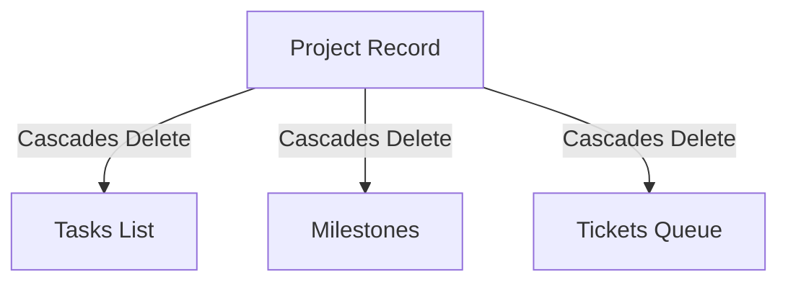

# 🗂️ OrganiStation Project Management Service

The **Project Management Service** is a core Python FastAPI microservice responsible for orchestrating the company's workspaces, including projects, task boards, milestones, and support ticketing pipelines.

---

## ✨ Key Features

- **Project Board Workspace**: Creates and tracks projects with start dates, deadlines, priority, and owners.
- **Kanban Task Boards**: Manages individual tasks (statuses: `todo`, `in_progress`, `done`) assigned to team members.
- **Milestone Checkpoints**: Handles completion metrics and checkpoints for projects.
- **Support & Issue Tickets**: Operates a ticketing queue for bug reporting and task delegation, tracking reporters, assignees, and priorities.
- **Cascaded Task Cleanups**: Automatically deletes all nested tasks, milestones, and tickets when a parent project is removed.
- **Automatic Indexing**: On startup, it establishes performance indexes:
  - `projects.name`
  - `tasks.project_id`
  - `tickets.project_id`
  - `milestones.project_id`
- **Cascaded User Purge**: Automatically cleans up or deletes projects, tasks, and tickets owned by or assigned to a user when their profile is deleted, protected by `X-Internal-Secret`.

---

## 🛠️ Technology Stack

- **Framework**: FastAPI (Python 3.10+)
- **Database**: MongoDB (via `motor` asynchronous driver)
- **Settings Management**: `python-dotenv`

---

## 📂 Project Hierarchy & Cascades



---

## ⚙️ Configuration & Environment Variables

Create a `.env` file in the root of the `project-management-service` directory (you can copy `.env.example` as a template).

| Variable | Description | Default | Required |
| :--- | :--- | :--- | :--- |
| `PORT` | Service port | `8003` | No |
| `HOST` | Bind address | `0.0.0.0` | No |
| `MONGODB_URI` | Connection URI for MongoDB | `mongodb://localhost:27017` | Yes |
| `DB_NAME` | Database name | `organistation_projects` | No |
| `INTERNAL_SERVICE_SECRET` | Secret to authenticate internal user purge requests | `organistation_internal_secret` | Yes (in Prod) |

---

## 🚀 API Endpoints

### 🗂️ Project Endpoints (`/api/projects`)

* **`GET /api/projects`**: List all projects.
* **`POST /api/projects`**: Create a new project workspace.
* **`GET /api/projects/{pid}`**: Fetch details of a project by ID.
* **`PUT /api/projects/{pid}`**: Update project details.
* **`DELETE /api/projects/{pid}`**: Deletes the project and all associated tasks/milestones/tickets.

---

### 📋 Task Endpoints (`/api/tasks` & `/api/projects/{pid}/tasks`)

* **`GET /api/projects/{pid}/tasks`**: Fetch all tasks assigned to a project.
* **`POST /api/projects/{pid}/tasks`**: Create a new task within a project.
* **`PUT /api/tasks/{tid}`**: Update task status (`todo` / `in_progress` / `done`), assignee, or details.

---

### 📅 Milestone Endpoints (`/api/projects/{pid}/milestones`)

* **`GET /api/projects/{pid}/milestones`**: Fetch all milestones mapped to a project.
* **`POST /api/projects/{pid}/milestones`**: Create a milestone checkpoint.

---

### 🎫 Ticket Endpoints (`/api/tickets`)

* **`GET /api/tickets`**: List all issues/support tickets.
* **`POST /api/tickets`**: Create/report a new support ticket.
* **`PUT /api/tickets/{tid}`**: Assign a ticket or update its priority and status (`open` / `in_progress` / `closed`).
* **`DELETE /api/tickets/{tid}`**: Delete a ticket.

---

### 🔒 Internal Endpoints (Requires `X-Internal-Secret` header)

* **`POST /api/internal/purge-user`**:
  - Drops projects owned by the user, and clears tasks/tickets where they are the assignee or reporter.

---

## 💻 Local Development

### 1. Setup Virtual Environment
```bash
python -m venv venv
source venv/bin/activate  # On Windows: .\venv\Scripts\activate
pip install -r requirements.txt
```

### 2. Configure MongoDB
Ensure MongoDB is running locally on port `27017` or update the `MONGODB_URI` in `.env`.

### 3. Run the Server
```bash
python app.py
```
The server will start at `http://localhost:8003`. You can access interactive API docs at `http://localhost:8003/docs`.

---

## 🐳 Docker Deployment

To build and run the service inside a Docker container:

```bash
# Build the Image
docker build -t organistation-project-service .

# Run the Container
docker run -d \
  -p 8003:8003 \
  --env-file .env \
  organistation-project-service
```
